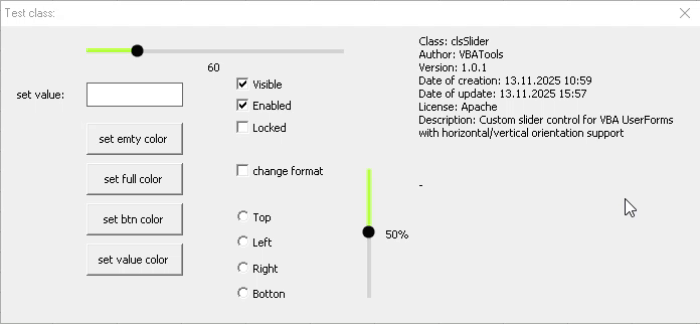

# Класс VBA Slider



Этот репозиторий содержит реализацию на VBA настраиваемого слайдер-контрола, который можно использовать в Excel UserForms. Класс слайдера предоставляет более гибкую и функциональную альтернативу стандартному элементу управления scrollbar.

## Содержание
1. [Возможности](#возможности)
2. [Компоненты](#компоненты)
3. [Установка](#установка)
4. [Быстрый старт](#быстрый-старт)
5. [Основные функции](#основные-функции)
6. [Работа с элементами управления](#работа-с-элементами-управления)
7. [Настройка стиля](#настройка-стиля)
8. [Устранение неполадок](#устранение-неполадок)

## Возможности

- Настраиваемый внешний вид слайдера (размер, цвета, ориентация)
- Поддержка горизонтальной и вертикальной ориентации
- Настраиваемые минимальные и максимальные значения
- Контроль размера шага для точного выбора значения
- Обработка событий при изменении значения
- Плавные визуальные обновления
- Трехпозиционная функциональность (снят, установлен, неопределён)
- Циклическое/непрерывное переключение состояний
- Возможность установки/получения состояния по тексту
- Метод для получения всех доступных состояний
- Улучшенная обработка ошибок и проверки
- Возможность установки имени шрифта и коэффициента размера
- Возможность получения/установки текущего значка
- Метод для установки цвета для конкретного состояния
- Метод для сброса в начальное состояние

## Компоненты

- `clsSlider.cls`: Основная реализация класса слайдера
- `frmTestClass.frm`: Тестовая форма, демонстрирующая использование
- `modShowForms.bas`: Модуль, содержащий функции отображения форм
- Документация в папке `docs/`:
 - [`docs/technical_documentation_rus.md`](docs/technical_documentation_rus.md) - Техническая документация на русском языке
  - [`docs/technical_documentation_eng.md`](docs/technical_documentation_eng.md) - Техническая документация на английском языке
  - [`docs/user_guide_rus.md`](docs/user_guide_rus.md) - Руководство пользователя на русском языке
  - [`docs/user_guide_eng.md`](docs/user_guide_eng.md) - Руководство пользователя на английском языке
  - [`docs/implementation_examples_rus.md`](docs/implementation_examples_rus.md) - Примеры реализации на русском языке
  - [`docs/implementation_examples_eng.md`](docs/implementation_examples_eng.md) - Примеры реализации на английском языке

## Установка

1. Откройте книгу `slider_v4.xlsm` в Excel
2. Импортируйте файлы VBA в ваш проект:
   - `vba-files/Class/clsSlider.cls`
   - `vba-files/Form/frmTestClass.frm`
   - `vba-files/Module/modShowForms.bas`
3. Начните использовать класс слайдера в ваших формах

## Быстрый старт

### Простой пример использования
```vba
' В модуле формы
Dim Slider As clsSlider

Private Sub UserForm_Initialize()
    ' Создание экземпляра класса слайдера
    Set Slider = New clsSlider
    
    ' Инициализация слайдера с параметрами по умолчанию
    Call Slider.Initialize(Me.Label1, 50, 0, 100, True)
End Sub
```

## Основные функции

- **Инициализация слайдера**: Метод `Initialize` позволяет установить начальное значение, минимальное и максимальное значения, а также настроить внешний вид
- **Управление диапазоном**: Возможность настройки минимальных и максимальных значений
- **Настройка ориентации**: Поддержка горизонтальной и вертикальной ориентации
- **Обработка событий**: Поддержка событий изменения значения и клика
- **Плавные обновления**: Визуальное отображение изменений значения

## Работа с элементами управления

Класс `clsSlider` использует элемент Label как дорожку слайдера с возможностью:
- Установки начального значения
- Настройки минимального и максимального значений
- Обработки событий перетаскивания
- Отображения метки значения с настраиваемыми позициями

## Настройка стиля

Класс позволяет настраивать:
- Цвета дорожки (пустые/заполненные участки)
- Цвета кнопки слайдера
- Цвета метки значения
- Цвета фона
- Шрифты и размеры текста

Пример настройки цветов:
```vba
' Настройка цветов при инициализации
Slider.Initialize Me.Label1, 50, 100, True, , , RGB(200, 200, 200), RGB(0, 100, 200)
```

## Устранение неполадок

### Проблемы с отображением
- Убедитесь, что Microsoft Forms 2.0 Object Library включена в ссылки
- Проверьте, что элемент управления Label добавлен до вызова метода Initialize
- Убедитесь, что свойство MultiUse установлено в True для класса

### Проблемы с взаимодействием
- Проверьте, что события элемента управления не перегружены другими обработчиками
- Убедитесь, что свойства элемента управления не изменяются вручную во время работы класса
- Проверьте, что класс не инициализируется несколько раз

## Лицензия

Этот проект лицензирован в соответствии с Apache License 2.0 - см. файл [LICENSE](LICENSE) для получения подробностей.